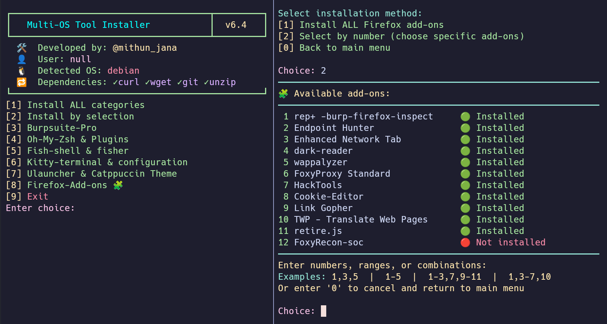
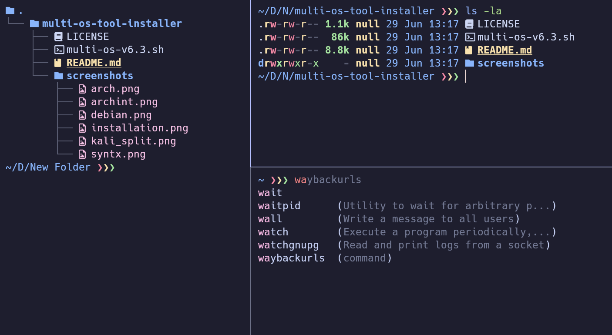

<div align="center">

# Multi-OS Security Tool Installer

[](https://github.com/mithunjana0051/multi-os)
[](https://www.gnu.org/software/bash/)
[](https://www.linux.org/)
[](LICENSE)

> **One script. Multiple distros. Full pentesting lab in minutes.**  
> Automates setup of 60+ security tools, terminal ricing, shell configuration, and Firefox security extensions across Arch Linux and Debian-based systems (Kali, Parrot, Ubuntu).

</div>

---

## 📸 Screenshots

### Interface

### Fish Shell with Kitty


---

## 📋 Table of Contents

- [Features](#-features)
- [Supported Systems](#-supported-systems)
- [Quick Start](#-quick-start)
- [Menu Overview](#-menu-overview)
- [Tool Categories](#-tool-categories)
- [What Gets Configured](#-what-gets-configured)
- [Requirements](#-requirements)
- [How It Works](#-how-it-works)
- [Author](#-author)

---

## ✨ Features

- **Auto OS Detection** — Automatically detects Arch, Kali, Parrot, or Debian and picks the right package manager and install method
- **Smart Install Checks** — Never reinstalls a tool that already exists; idempotent by design
- **Flexible Selection** — Install everything at once, pick entire categories by letter, or cherry-pick individual tools by number — even mix them (`a,15,23`)
- **AUR Support** — Auto-installs `yay` on Arch and uses it for AUR packages seamlessly
- **Manual Fallbacks** — Tools not in official repos (feroxbuster, rustscan, amass, etc.) are fetched directly from GitHub releases
- **Terminal Ricing** — Installs and fully configures Kitty terminal + Catppuccin + Hack Nerd Font + Fish/Zsh
- **Fish Shell Setup** — Installs fisher, plugins, grc color aliases, ZSH history migration, and sets fish as default shell
- **Oh-My-Zsh Setup** — Installs with autosuggestions, fast-syntax-highlighting, and autocomplete plugins
- **Ulauncher + Catppuccin** — Installs Ulauncher app launcher with full Catppuccin theme and autostart
- **Firefox Add-ons Manager** — New in v6.4: installs 12 curated security extensions into your active Firefox profile via a dedicated module
- **Go Toolchain Management** — Automatically installs Go, configures `GOPATH`, and builds Go-based tools from source with full error handling
- **Sound Fixes** — Applies WirePlumber/PipeWire config to fix audio latency issues common in VMs
- **VMware Tools** — Auto-enables `open-vm-tools` and `vmtoolsd` for guest VM environments
---

## 🐧 Supported Systems

| OS | Status | Package Manager |
|---|---|---|
| Arch Linux | ✅ Full support | `pacman` + `yay` (AUR) |
| Kali Linux | ✅ Full support | `apt` |
| Parrot OS | ✅ Full support | `apt` |
| Debian / Ubuntu | ✅ Full support | `apt` |

---

## Quick Start

```bash
# 1. Clone the repo
git clone https://github.com/mithunjana0051/multi-os.git
cd multi-os

# 2. Make executable
chmod +x multi-os-v6.4.sh

# 3. Run
./multi-os-v6.4.sh
```

> ⚠️ **Run as a regular user with sudo access** — do NOT run as root directly.

> 📁 For Firefox Add-ons, place `firefox-addons.sh` inside a `module/` folder next to the main script.

---

## Menu Overview

```
┏━━━━━━━━━━━━━━━━━━━━━━━━━━━━━━━━━━━━━┳━━━━━━━━━┓
┃   Multi-OS Tool Installer           ┃  v6.4   ┃
┗━━━━━━━━━━━━━━━━━━━━━━━━━━━━━━━━━━━━━┻━━━━━━━━━┛

[1] Install ALL categories
[2] Install by selection
[3] Burpsuite-Pro
[4] Oh-My-Zsh & Plugins
[5] Fish-shell & fisher
[6] Kitty terminal & configuration
[7] Ulauncher & Catppuccin Theme
[8] Firefox Add-ons 🧩
[9] Exit
```
## 🛠️ Tool Categories

### Recon
`amass` `subfinder` `httpx` `nikto` `nuclei` `wpscan` `gau` `hakrawler` `waybackurls`

### Network
`nmap` `rustscan` `netdiscover` `arp-scan` `aircrack-ng` `wifite` `wireless-tools` `wpa_supplicant` `wireshark`

### Bruteforce & Fuzzing
`feroxbuster` `ffuf` `gobuster` `dirsearch` `dirb` `dirbuster` `hydra` `hashcat` `john` `crunch` `wordlists` `seclists`

### Exploitation
`metasploit` `sqlmap` `ghauri` `exploitdb` `social-engineer-toolkit` `powershell-empire`

### Reverse Engineering
`ghidra` `ILSpy` (AvaloniaILSpy) `pyinstxtractor`

### Active Directory *(Debian/Kali only)*
`impacket`

### Utils
`git-dumper` `openvpn` `net-tools` `netcat` `curl` `openssh` `nano` `zip` `python3-pip`

### Productivity
`sublime-text-4` `firefox` `vlc` `remmina` `stacer` `neofetch` `vim` `gparted` `konsole` `qterminal` `xarchiver` `xterm`

### Sound
`pipewire` `pipewire-pulse` `pipewire-alsa` `pipewire-jack` `wireplumber` `alsa-utils` (with latency config applied)

### VMware
`open-vm-tools` `xf86-input-vmmouse` `virtualbox-guest-utils` (auto-enabled as service)

---

## ⚙️ What Gets Configured

### 🦊 Firefox Add-ons Manager *(New in v6.4)*
A dedicated module (`module/firefox-addons.sh`) that manages security extensions for your active Firefox profile:

| Add-on | Purpose |
|---|---|
| rep+ Burp Firefox Inspect | Burp Suite integration |
| Endpoint Hunter | API endpoint discovery |
| Enhanced Network Tab | Advanced network inspection |
| Dark Reader | Dark mode for all sites |
| Wappalyzer | Technology fingerprinting |
| FoxyProxy Standard | Proxy switcher |
| HackTools | Pentest toolkit in browser |
| Cookie-Editor | Cookie inspection & editing |
| Link Gopher | Extract all links from a page |
| TWP - Translate Web Pages | In-page translation |
| Retire.js | Detect vulnerable JS libraries |
| FoxyRecon-SOC | OSINT & recon tools |

- Auto-detects the active Firefox profile
- Install individually or all at once
- Status view to check which add-ons are already installed

### 🐱 Kitty Terminal
- Installs **Hack Nerd Font** and **Noto Color Emoji**
- Applies **Catppuccin Mocha** theme
- Enables cursor trail, 10,000 line scrollback, powerline tab bar

#### ⌨️ Key Bindings

| Shortcut | Action |
|---|---|
| `Ctrl+Shift+C` | Copy to clipboard |
| `Ctrl+Shift+V` | Paste from clipboard |
| `Ctrl+T` | New tab |
| `Ctrl+d` | Close tab |
| `Shift+Ctrl+→` | Next tab |
| `Shift+Ctrl+←` | Previous tab |
| `Ctrl+Shift+Enter` | New window |
| `Ctrl+A` | Split horizontally (hsplit) |
| `Ctrl+V` | Split vertically (vsplit) |
| `Ctrl+←` | Focus window left |
| `Ctrl+→` | Focus window right |
| `Ctrl+↑` | Focus window up |
| `Ctrl+↓` | Focus window down |
| `Ctrl+Shift+F` | Toggle layout stack (zoom) |
| `Shift+Z` | Toggle layout stack (zoom) |
| `Alt+F` | Toggle fullscreen |
| Middle click | Paste from clipboard |

---

### 🌳 eza Integration & Aliases

[eza](https://github.com/eza-community/eza) replaces `ls` and `tree` with a modern, icon-aware, colorized alternative. Configured automatically inside Fish shell's `config.fish`:

```fish

    alias ls='eza --color=always --icons'
    alias tree='eza --tree --icons -a'

```

| Command | What it does |
|---|---|
| `ls` | Colorized listing with file-type icons |
| `tree` | Full recursive tree view with icons, including hidden files |

#### 🎨 grc Colorized Command Aliases

The following system commands are wrapped with `grc` for colorized output and saved as persistent Fish functions:

| Command | Effect |
|---|---|
| `ip` | Colorized IP routing output (`ip -color=auto`) |
| `ping` | Colorized ping output |
| `ps` | Colorized process list |
| `lsblk` | Colorized block device listing |
| `ifconfig` | Colorized network interface info |
| `ss` | Colorized socket statistics |
| `nc` | Colorized netcat output |
| `traceroute` | Colorized traceroute output |
| `curl` | Colorized curl output |
| `mount` | Colorized mount listing |
| `cat` | Replaced with `bat --paging=never` (syntax-highlighted file viewer) |

### 🐟 Fish Shell
- Installs **fisher** plugin manager
- Plugins: `dracula/fish`, `catppuccin/fish`, `jhillyerd/plugin-git`, `edc/bass`
- Sets **Catppuccin Frappé** prompt theme
- Adds `grc` color wrappers for `ping`, `curl`, `ifconfig`, `ss`, `nc`, `mount`
- Migrates ZSH history to Fish format
- Sets Fish as default shell via `usermod`

### 💤 Oh-My-Zsh
- Plugins: `zsh-autosuggestions`, `fast-syntax-highlighting`, `zsh-autocomplete`
- Auto-updates `.zshrc` plugin list

### 🚀 Ulauncher
- Installs all **Catppuccin** flavor themes with blue accent
- Sets hotkey to `Ctrl+Space`
- Configures autostart on login
---

## 📦 Requirements

| Requirement | Detail |
|---|---|
| OS | Arch Linux / Kali / Parrot / Debian / Ubuntu |
| Shell | `bash` 4.0+ |
| Core deps | Auto-installed: `curl` `wget` `git` `unzip` `python3` `pip` |

---

## 🔍 How It Works

```
Script Start
    │
    ├─► detect_os()                    # Reads /etc/arch-release or /etc/debian_version
    ├─► install_core_dependencies()    # curl, wget, git, unzip, pip
    ├─► install_yay()                  # Arch only: builds yay from AUR
    ├─► load_firefox_module()          # Loads module/firefox-addons.sh if present
    │
    └─► Interactive Menu Loop
            │
            ├─► install_by_selection()
            │       ├─► check_package_status()    # Installed? In repo? Manual method?
            │       ├─► install_pkg()              # pacman / yay / apt-get
            │       ├─► install_pkg_aur()          # yay or manual fallback for Debian
            │       ├─► install_go()               # Go toolchain (shared across tools)
            │       ├─► setup_go_env()             # GOPATH + shell config
            │       └─► Special installers         # GitHub releases, pip, go build
            │
            ├─► firefox_addons_manager()           # Module [8] — install Firefox extensions
            │
            └─► Post-install hooks
                    ├─► post_install_sound()       # WirePlumber config
                    ├─► post_install_wordlist()    # seclists, dirb
                    └─► post_vmware_setup()        # enable services
```

---

## 👤 Author

**@mithun_jana**

> Built for security researchers, CTF players, and pentesters who want a clean lab up fast — without clicking through package managers for an hour.

---

<div align="center">

⭐ **If this saved you time, drop a star!** ⭐

</div>
